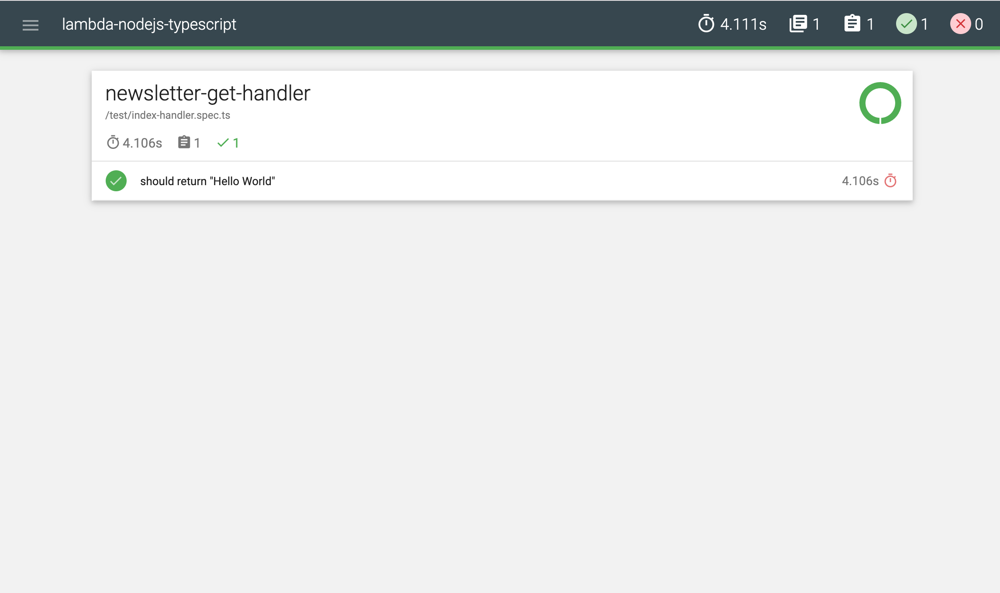

[](https://snyk.io/test/github/andreas-straub/lambda-nodejs-typescript?targetFile=package.json)

## Serverless AWS Lambda, Nodejs and TypeScript Boilerplate

This project contains boilerplate code for projects based on AWS lambda functions with Nodejs runtime and TypeScript.

## Includes:

- TypeScript language for development
- Nodejs Runtime
- Serverless Framework
- Offline Lambda execution
- Unit Tests with Mocha and Mochawesome Reporter
- Preconfigured Logger
- Preconfigured Prettier
- Preconfigured Linter
- Webpack
- Template for AWS Codepipline `buildspec.yml`

## Invoking a single handler locally

Run `serverless invoke local -f [functionName]`.

## Run API locally

In order to run your serverless lambdas locally, just start them with `npm run start`
(see: [https://github.com/dherault/serverless-offline](https://github.com/dherault/serverless-offline)).

### After start:

- Visit [http://localhost:3000/] to list the available routes.

## Linting / Formating

* Use `npm run lint` or `npm run lint-fix` to run a linter checks.
* Use `npm run format` to format the source code

## Test

`mocha` and `chai` libs with `mochaawesome`-reporter were used for tests. Tests are defined inside `/test` folder.  
Execute `npm run test` to run all tests.
 
After execution you can check results by calling `/mochawesome-report/mochawesome.html` in your default browser. 
It should looks like:



## Build

Run `npm run build` to build an package serverless project.

## Deploy

Run `npm run deploy-{STAGE}` to deploy the application to provided stage. Where `{STAGE}` ist one of `local`, `dev`, `test` or `prod`.
The list of available stages can be configured in `serverless.yml` in `custom.stages` property. The command will deploy
the current application to your AWS account. You should first configure you AWS credentials properly!
(see https://serverless.com/framework/docs/providers/aws/guide/credentials/ for more details)

Alternatively yo can run `serverless deploy -s {STAGE}`

After execution your will find a URL to your AWS ApiGateway Endpoint. It should looks like this:
```bash
Serverless: Stack update finished...
Service Information
service: lambda-nodejs-typescript
stage: dev
region: eu-central-1
stack: lambda-nodejs-typescript-dev
resources: 10
api keys:
  None
endpoints:
  GET - https://l5xdlwcwcl.execute-api.eu-central-1.amazonaws.com/dev/
functions:
  index: lambda-nodejs-typescript-dev-index
layers:
  None
```

## Undeploy (remove from AWS)

To remove the deployed infrastructure from AWS just run `serverless remove -s {STAGE}` 

After execution you should get following output:
```bash
Serverless: Getting all objects in S3 bucket...
Serverless: Removing objects in S3 bucket...
Serverless: Removing Stack...
Serverless: Checking Stack removal progress...
...................
Serverless: Stack removal finished...
```

## Contact

**Developer Andreas Straub**

```
Email: kontakt@andreas-straub.biz
Telefon: +49 40 882159 40
```

## License

Copyright 2019 Andreas Straub

Licensed under the Apache License, Version 2.0 (the "License");
you may not use this file except in compliance with the License.
You may obtain a copy of the License at

    http://www.apache.org/licenses/LICENSE-2.0

Unless required by applicable law or agreed to in writing, software
distributed under the License is distributed on an "AS IS" BASIS,
WITHOUT WARRANTIES OR CONDITIONS OF ANY KIND, either express or implied.
See the License for the specific language governing permissions and
limitations under the License.
